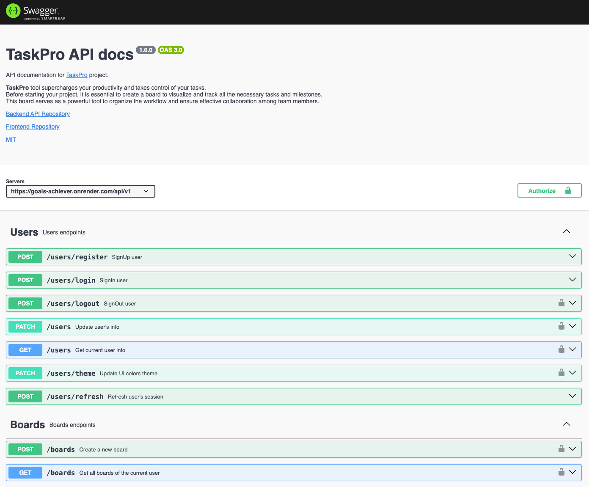

<h1 align="center">
  
</h1>

Supercharge your productivity and take control of your tasks with Task Pro.  Don't wait, start achieving your goals now!

## Introduction
This project was created as a backend API for our <a href='https://tim-pashkevych.github.io/goals-achiever-react/welcome'>TaskPro</a> tool. 
Our API was designed according to REST software architecture by using  <a href='https://expressjs.com/'>Express.js</a> framework. 
For authentication, we have used <a href='https://jwt.io/'>JWT</a>. All data is stored in <a href='https://expressjs.com/'>MongoDB</a> database. 
To store, transform, optimize, and deliver all images, we used <a href='https://cloudinary.com/'>Cloudinary</a>. 
<a href="https://www.mailjet.com/">Mailjet</a> was selected  as a mail server provider.

## Under the hood
- **Express.js**: minimal and flexible Node.js web application framework.
- **REST**: as a software architectural.
- **JSON Web Token (JWT)**: powerful and flexible tool for secure authentication and data exchange between parties.
- **Cloudinary** and **Mailjet** integration
- **Swagger**: API Documentation & Design Tools.
- **MongoDB**: cross-platform, document-oriented NoSQL database.

## Swagger

## Demo
This project is deployed on Render. Check our **Swagger** documentation:
[**TaskPro API**](https://goals-achiever.onrender.com/)

## Contributors
This project was crafted by a team of developers.
Guys, I am very appreciative of every your commit and your hard work. 
Let's dream and make dreams come true.

    
